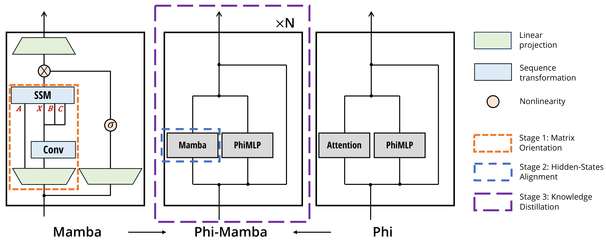

# Phi-Mamba


> **Transformers to SSMs: Distilling Quadratic Knowledge to Subquadratic Models**\
> Aviv Bick*, Kevin Y. Li*, Eric P. Xing, J. Zico Kolter, Albert Gu \
> Paper: https://arxiv.org/abs/2408.10189 \
> Blogpost: https://goombalab.github.io/blog/2024/distillation-part1-mohawk/

## About

Phi-Mamba is a subquadratic, Mamba-based model distilled from Phi-1.5 using the MOHAWK method with only 3B tokens. MOHAWK allows cross-architectural distillation from Transformers by viewing Attention and, in this case, SSMs as sequence transformations that can be aligned. MOHAWK consists of three stages which gradually increase the scope of distillation: starting from each layer's matrix mixer, then to the hidden state of each layer, and finally the entire model. 

## Installation
Installation instructions are heavily inspired by the original [state-spaces/mamba](https://github.com/state-spaces/mamba) repo. Note, `torch>=2.2` has seemed to give issues with the package, so please use `torch==2.1` for now

- [Optional] `pip install causal_conv1d==1.1.1`: an efficient implementation of a simple causal Conv1d layer used inside the Mamba block.
- `pip install mamba-ssm`: the core Mamba package.
- `pip install flash-attn==2.5.8`: only used for the hybrid Phi-Mamba model

## Usage

### Phi-Mamba Language Model

Phi-Mamba is a model that replaces the self-attention mechanism in Phi-1.5 with a Mamba-2 matrix mixer variant. The model is composed of backbone consisting of an embedding layer and sequential Phi-Mamba blocks and a language model head. The code can be found at 
[./modules/lm_head.py](./modules/LMHead.py).

```python
import torch
from modules.lm_head import LMHeadModel
from utils.config import Config

cfg = Config.from_json("assets/sample_config.json")

batch, length = 2, 64
x = torch.randint(low=0, high=100, size=(batch, length)).to("cuda")
model = LMHeadModel(cfg).to("cuda")
y = model(x).logits
assert y.shape[:2] == x.shape
```

### Phi-Mamba Model Block

The Phi-Mamba block allows for additional intermediate states, e.g., Mamba-2 transfer matrix, matrix mixer hidden state, to be returned for users. This allows users to conduct their own Stage 1 or 2 of MOHAWK or interpolate the implementation to run MOHAWK on other teacher models! The code is implemented at [./modules/phi_block.py](./modules/phi_block.py). 

```python
import torch
from modules.phi_block import Block
from utils.config import Config

cfg = Config.from_json("assets/sample_config.json")
block_cfg = cfg["Block1"]

batch, length, dim = 2, 64, 128
x = torch.randn(batch, length, dim).to("cuda")
model = Block(
    d_model=dim,
    config=block_cfg,
    factory_kwargs={"device": "cuda", "dtype": None},
    layer_idx=0
).to("cuda")
y = model(x)["hidden_states"]
assert y.shape == x.shape
```

### Matrix Mixer 

The matrix mixer used in Phi-Mamba is a discrete variant of the [Mamba-2 matrix mixer](https://arxiv.org/abs/2405.21060). Specifically, Phi-Mamba's matrix mixer uses a multi-head structure (unlike the multi-value structure of Mamba-2), and does not have a non-linear activation function nor layer normalization (both are found in Mamba-2). 

The code is found at [./modules/mixers/DiscreteMamba2.py](./modules/mixers/DiscreteMamba2.py).

```python
import torch
from modules.mixers.discrete_mamba2 import Mixer

batch, length, dim = 2, 64, 128
x = torch.randn(batch, length, dim).to("cuda")
d_model = 128
model = Mixer(
    d_model=dim,
    d_state=64,
    nheads=32,
    d_conv=4,
).to("cuda")
y = model(x)["hidden_states"]
assert y.shape == x.shape
```

### Pretrained Weights
Weights of Phi-Mamba train on C4 using the MOHAWK method can be found on [Huggingface](https://huggingface.co/goombalab/Phi-Mamba). 

```python
import torch
from transformers import AutoTokenizer
from modules.lm_head import LMHeadModel

device = "cuda"
mamba = LMHeadModel.from_pretrained("goombalab/Phi-Mamba", strict=True).to(device)
tokenizer = AutoTokenizer.from_pretrained("microsoft/phi-1_5")
tokens = tokenizer(prompt, return_tensors="pt")
input_ids = tokens.input_ids.to(device=device)
output = mamba.generate(input_ids, max_length=100)
print(tokenizer.batch_decode(output))
```
A more in-depth example of how to use the generate function for both Phi-Mamba and Hybrid-Phi-Mamba can be found in [./generation.py](./generation.py)

## Evaluations
The instructions are based on the past [state-spaces/mamba](https://github.com/state-spaces/mamba) repo instructions for running evaluations.

To run zero-shot evaluations of models (corresponding to Table 3 of the paper),
 we use the
[lm-evaluation-harness](https://github.com/EleutherAI/lm-evaluation-harness/tree/big-refactor)
library.

1. Pull the `lm-evaluation-harness` repo by `git submodule update --init
  --recursive`. We use the `big-refactor` branch.
2. Install `lm-evaluation-harness`: `pip install -e 3rdparty/lm-evaluation-harness`.
On Python 3.10 you might need to manually install the latest version of `promptsource`: `pip install git+https://github.com/bigscience-workshop/promptsource.git`.
3. Run evaluation with (more documentation at the [lm-evaluation-harness](https://github.com/EleutherAI/lm-evaluation-harness/tree/big-refactor) repo):
```
python lm_harness_eval.py --model phi-mamba --tasks lambada_openai,hellaswag,piqa,arc_easy,arc_challenge,winogrande --device cuda --batch_size 64
```

## MOHAWK Stage 1 Example
Stage 1 of MOHAWK matches the matrix mixer of both the student and the teacher. The code below shows how to ensure the teacher and student matrix mixer take the same input and how to match the their matrices. A more comprehensive example can be found in [./assets/mohawk_stage1.py](./assets/mohawk_stage1.py)

```python
layer_idx = 0
teacher_outputs = teacher_model(
    input_ids=input_ids,
    output_hidden_states=True,
    output_attention_results=True,
    output_attentions=True,
    use_cache=False
)
student_input = teacher_outputs.all_hidden_state[layer_idx]
student_output = student_layer(
    hidden_states=student_input,
    run_mlp_component=not freeze_mlp,
    return_hidden_states=not freeze_mlp
)
transfer_matrix = student_output["transfer_matrix"][
    ..., :seq_len, :seq_len
] # because of our Mamba2 chunking implementation
attn_matrix = teacher_outputs.all_attn_matrices[layer_idx]
loss = torch.linalg.matrix_norm(
    transfer_matrix - attn_matrix, ord="fro"
).mean()
```

## MOHAWK Stage 2 Example
Stage 2 of MOHAWK matches the output of the student and teacher matrix mixer layers. The code belows shows how to do this. A more comprehensive example can be found in [./assets/mohawk_stage2.py](./assets/mohawk_stage2.py)

```python
freeze_mlp = True  # up to training scheme
layer_idx = 0
teacher_outputs = teacher_model(
    input_ids=input_ids,
    output_hidden_states=True,
    use_cache=False,
    output_attention_results=freeze_mlp
)
student_input = teacher_outputs.all_hidden_state[layer_idx]
student_output = student_layer(
    hidden_states=student_input,
    run_mlp_component=not freeze_mlp,
    return_hidden_states=not freeze_mlp
)
teacher_hstate = (
    teacher_outputs.all_attn_outputs[layer_idx]
    if freeze_mlp
    else teacher_outputs.all_hidden_states[layer_idx + 1]
)
loss = torch.norm(
    student_output["hidden_states"] - teacher_hstate, p=2, dim=(-1,)
).mean()
```
## Citation
If you use this codebase, or otherwise find our work valuable, please cite Phi-Mamba:
```
@article{distill-mohawk,
  title={Transformers to SSMs: Distilling Quadratic Knowledge to Subquadratic Models},
  author={Bick, Aviv and Li, Kevin Y. and Xing, Eric P. and Kolter, J. Zico and Gu, Albert},
  journal={arXiv preprint arXiv:2408.10189},
  year={2024}
}
```
